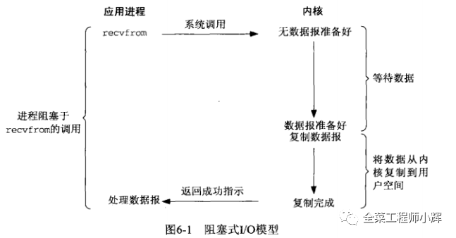
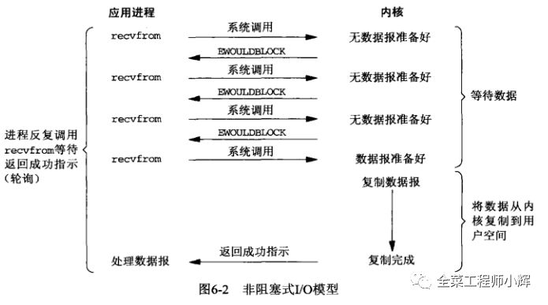
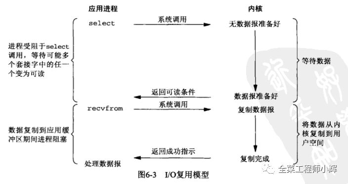
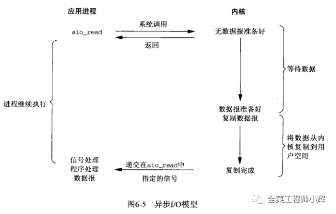
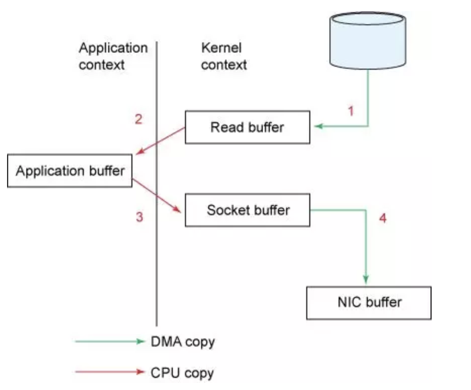
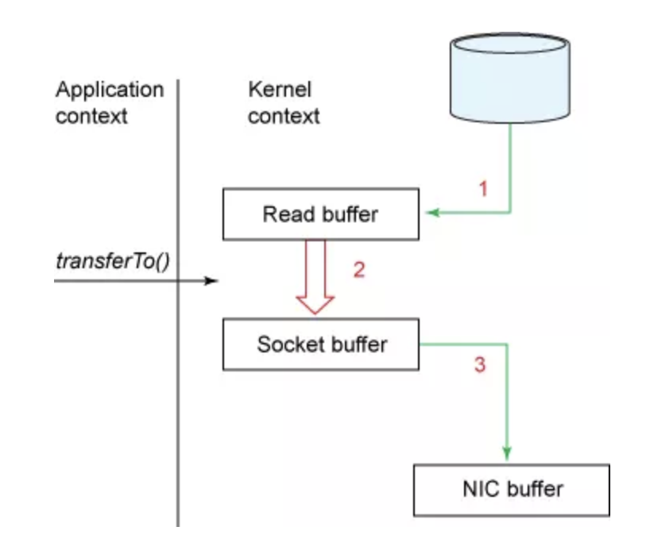
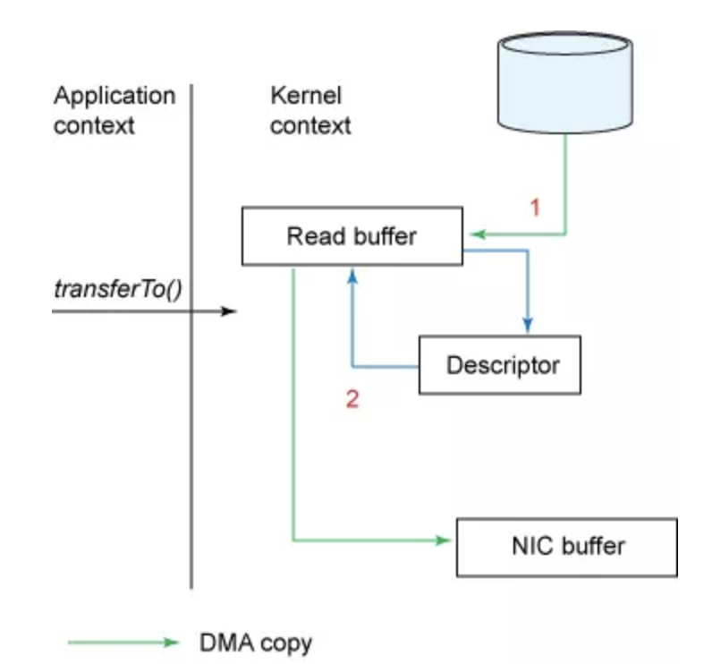

[参考文章1](https://blog.csdn.net/y277an/article/details/98342473)

# Java IO模型

Unix网络编程有五种IO模型：

+ blocking IO 阻塞IO
+ nonblockig IO 非阻塞IO
+ IO multiplexing 多路复用IO
+ signal IO 信号驱动IO
+ asynchronous IO 异步IO

## 一、背景

java.io包基于流模型实现，提供File抽象、输入输出流等IO的功能，交互方式是同步、阻塞的方式，在读取输入流或者写入输出流时，在读写动作完成之前，线程会一直阻塞。

java.io包的好处是代码比较简单、直观，缺点则是IO效率和扩展性存在局限性，容易成为应用性能的瓶颈。

java.net下面提供的部分网络API，比如Socket、ServerSocket、HttpURLConnection 也时常被归类到同步阻塞IO类库，因为网络通信同样是IO行为。

在Java1.4中引入了NIO框架java.nio包，提供了channel、selector、buffer等新的抽象，可以构建多路复用IO程序，提供更接近操作系统等次的高性能数据操作方式。

在Java7中，NIO有了进一步的改进，也就是NIO2，引入了异步非阻塞IO方式，也被称为AIO（Asynchronous IO），异步IO操作基于事件和回调机制。

## 二、基本概念

### 1、同步与异步

同步和异步是针对应用程序和内核的交互而言的。

+ 同步指的是用户进程触发IO操作并等待或者轮询的去查看IO操作是否就绪。例如：自己上街买衣服，自己亲自干这件事，别的事干不了。

+ 异步指的是用户进程触发IO操作以后便开始做其他的事情，而当IO操作已经完成的时候会得到IO完成的通知。例如：告诉朋友自己合适衣服的尺寸、颜色、款式，委托朋友去买，然后自己可以去干别的事。同时，你还需要告诉朋友你家衣柜在哪，方便朋友买完之后，直接将衣服放到你的衣柜。（使用异步I/O时，Java将I/O读写委托给OS处理，需要将数据缓冲区地址和大小传给OS）。

### 2、阻塞与非阻塞

阻塞和非阻塞是针对进程在访问数据的时候，根据IO操作的就绪状态来采取的不同方式。

+ 阻塞指的是当试图对该文件描述符进行读写时，如果当时没有东西可读，或暂时不可写，程序就进入等待状态，直到有东西可读或可写为止。去地铁站充值，发现这个时候充值员碰巧不在，然后我们就在原地等待，一直等到充值员回来为止。

+ 非阻塞指的是如果没有东西可读，或不可写，读写函数马上返回，而不会等待。在银行里办业务时，领取一张小票，之后我们可以玩手机，或与别人聊聊天，当轮到我们时，银行的喇叭会通知，这时候我们就可以去办业务了。

## 二、IO模型分类

应用程序向操作系统发出IO请求：应用程序发出IO请求给操作系统内核，操作系统内核需要等待数据就绪，这里的数据可能来自别的应用程序或者网络。一般来说，一个IO分为两个阶段：

1. 等待数据：数据可能来自其他应用程序或者网络，如果没有数据，应用程序就阻塞等待。

2. 拷贝数据：将就绪的数据拷贝到应用程序工作区。

在Linux系统中，操作系统的IO操作是一个系统调用recvfrom()，即一个系统调用recvfrom包含两步，等待数据就绪和拷贝数据。

### 1、同步阻塞IO

在此种方式下，用户进程在发起一个IO操作以后，必须等待IO操作的完成，只有当IO操作完成之后，用户进程才能运行。JAVA传统的BIO属于此种方式。

### 2、同步非阻塞IO

在此种方式下，用户进程发起一个IO操作以后边可返回做其它事情，但是用户进程需要时不时的询问IO操作是否就绪，这就要求用户进程不停的去询问，从而引入不必要的CPU资源浪费。JAVA的NIO就属于同步非阻塞IO。

### 3、多路复用IO

[参考文章](https://www.cnblogs.com/aspirant/p/9166944.html)

它的基本原理就是select/epoll这个function会不断的轮询所负责的所有socket，当某个socket有数据到达了，就通知用户进程。多路复用中，通过select函数，可以同时监听多个IO请求的内核操作，只要有任意一个IO的内核操作就绪，都可以通知select函数返回，再进行系统调用recvfrom()完成IO操作。

这个过程应用程序就可以同时监听多个IO请求，这比起基于多线程阻塞式IO要先进得多，因为服务器只需要少数线程就可以进行大量的客户端通信。

### 4、信号驱动式IO

在unix系统中，应用程序发起IO请求时，可以给IO请求注册一个信号函数，请求立即返回，操作系统底层则处于等待状态（等待数据就绪），直到数据就绪，然后通过信号通知主调程序，主调程序才去调用系统函数recvfrom()完成IO操作。

信号驱动也是一种非阻塞式的IO模型，比起上面的非阻塞式IO模型，信号驱动式IO模型不需要轮询检查底层IO数据是否就绪，而是被动接收信号，然后再调用recvfrom执行IO操作。

比起多路复用IO模型来说，信号驱动IO模型针对的是一个IO的完成过程， 而多路复用IO模型针对的是多个IO同时进行时候的场景。 信号驱动式IO模型用下图表示

### 5、异步IO

在此种模式下，将整个IO操作（包括等待数据就绪，复制数据到应用程序工作空间）全都交给操作系统完成。数据就绪后操作系统将数据拷贝进应用程序运行空间之后，操作系统再通知应用程序，这个过程中应用程序不需要阻塞。

## 三、BIO NIO AIO

### 1、BIO

在读取输入流或者写入输出流时，在读、写动作完成之前，线程会一直阻塞。

传统的服务器端同步阻塞I/O处理（也就是BIO，Blocking I/O）的经典编程模型。使用BIO的缺点如下：

1. 线程的创建和销毁成本很高，在Linux这样的操作系统中，线程本质上就是一个进程。创建和销毁都是重量级的系统函数。

2. 线程本身占用较大内存，像Java的线程栈，一般至少分配512K～1M的空间，如果系统中的线程数过千，占用的内存将非常惊人。

3. 线程的切换成本是很高的。操作系统发生线程切换的时候，需要保留线程的上下文，然后执行系统调用。如果线程数过高，可能执行线程切换的时间甚至会大于线程执行的时间，这时候带来的表现往往是系统load偏高、CPU sy使用率特别高（超过20%以上)，导致系统几乎陷入不可用的状态。

4. 容易造成锯齿状的系统负载。因为系统负载是用活动线程数或CPU核心数，一旦线程数量高而且外部网络环境不是很稳定，就很容易造成大量请求的结果同时返回，激活大量阻塞线程从而使系统负载压力过大。

所以，当面对十万甚至百万级连接的时候，传统的BIO模型是无能为力的。随着移动端应用的兴起和各种网络游戏的盛行，百万级长连接日趋普遍，此时，NIO技术应运而生。

### 2、NIO（零拷贝）

[参考文章](https://mp.weixin.qq.com/s?__biz=MzUyNzgyNzAwNg==&mid=2247483929&idx=1&sn=ed536aee5ac7f898fc5e640785769fd4&scene=21#wechat_redirect)

基于事件驱动思想，采用reactor（反应器）模式。当发起IO请求时，应用程序是非阻塞的。当SOCKET有流可读或写的时候，由操作系统通知应用程序，应用程序再将流读取到缓冲区或者写入系统。

BIO与NIO的区别：

1、**BIO是面向流的，NIO是面向缓冲区的。**

JavaIO面向流意味着每次从流中读一个或多个字节，直至读取所有字节，它们没有被缓存在任何地方。此外，它不能前后移动流中的数据。如果需要前后移动从流中读取的数据，需要先将它缓存到一个缓冲区。Java NIO的缓冲读取方法略有不同。数据读取到一个缓冲区，需要时可在缓冲区中前后移动。这就增加了处理过程中的灵活性。但是，还需要检查是否该缓冲区中包含所有需要处理的数据。而且，需确保当更多的数据读入缓冲区时，不要覆盖缓冲区里尚未处理的数据。

**2、非阻塞IO**

Java IO的各种流是阻塞的。这意味着，当一个线程调用read() 或write()时，该线程被阻塞，直到有数据被读取或者数据写入。该线程在阻塞期间不能做其他事情。而Java NIO的非阻塞模式，如果通道没有东西可读，或不可写，读写函数马上返回，而不会阻塞，这个线程可以去做别的事情。线程通常将非阻塞IO的空闲时间用于在其它通道上执行IO操作，所以一个单独的线程可以管理多个输入和输出通道（channel），即IO多路复用的原理。

**3、零拷贝**

#### 零拷贝

**目的：避免在用户态User Space和内核态Kernel Space之间来回拷贝数据**

##### 1、传统IO模型

在传统的文件IO中，调用操作系统提供的的底层标准IO系统调用函数read()、write()，此时调用此函数的进程从用户态切换到内核态，OS内核代码负责将相应的文件从磁盘上读取到内核的IO缓冲区中，然后经数据从IO缓冲区中读取到进程的私有地址中去。

1. read()导致上下文从用户态切换到内核态，内核通过sys_read()从文件读取数据。DMA引擎执行第一次拷贝：从文件读取数据到存储内核空间的缓冲区。
2. 请求的数据从内核读缓冲区拷贝到用户缓冲区，然后read() 方法返回。read()方法返回导致上下文从内核态切换到用户态。现在读取数据已经存储在用户空间的缓冲区中。至此，完成了一次IO的读取过程。
3. write()方法调用导致上下文从用户态切换至内核态，第三次拷贝数据用户空间重新拷贝到内核空间缓冲区，但是这次数据被写在一个不同的缓冲区，一个与目标套接字相关联的缓冲区。
4. write()系统调用返回导致第四次上下文切换（从内核态切换到从用户态），当DMA引擎将数据从内核缓冲区传输到协议引擎缓冲区时，第四次拷贝是独立切异步的。

总的来说，传统的I/O操作进行了4次用户空间与内核空间的上下文切换，以及4次数据拷贝。显然在这个用例中，从内核空间到用户空间内存的复制是完全不必要的，因为除了将数据转储到不同的buffer之外，我们没有做任何其他的事情。所以，我们能不能直接从hardware读取数据到kernel buffer后，再从kernel buffer写到目标地点不就好了。为了解决这种不必要的数据复制，操作系统出现了零拷贝的概念。注意，不同的操作系统对零拷贝的实现各不相同。在这里我们介绍linux下的零拷贝实现。

##### 2、带有DMA收集拷贝功能的sendfile实现的IO

NIO的零拷贝由transferTo方法实现。transferTo方法将数据从FileChannel对象传送到可写的字节通道（如Socket Channel等）。在transferTo方法内部实现中，由native方法transferTo0来实现，它依赖底层操作系统的支持。在UNIX和Linux系统中，调用这个方法会引起sendfile()系统调用，实现了数据直接从内核的读缓冲区传输到套接字缓冲区，避免了用户态(User-space) 与内核态(Kernel-space) 之间的数据拷贝。

1. transferTo方法调用触发DMA引擎将文件上下文信息拷贝到内核读缓冲区，接着内核将数据从内核缓冲区拷贝到与套接字相关联的缓冲区。

2. DMA引擎将数据从内核套接字缓冲区传输到协议引擎（第三次数据拷贝）。

相比传统IO，使用NIO零拷贝后改进的地方：

1. 我们已经将上下文切换次数从4次减少到了2次；
2. 将数据拷贝次数从4次减少到了3次（其中只有1次涉及了CPU，另外2次是DMA直接存取）。

##### 3、使用数据描述符代替数据拷贝进套接字缓冲区

如果底层NIC（网络接口卡）支持scatter-and-gather操作，可以进一步减少内核中的数据拷贝，这种方式不仅减少了上下文切换，而且同时消除了需要CPU参与的重复的数据拷贝。（两次上下文切换，两次数据拷贝）

用户这边的使用方式不变，依旧通过transferTo方法，但是方法的内部实现发生了变化：

1. transferTo方法调用触发DMA引擎将文件上下文信息拷贝到内核缓冲区。
2. 数据不会被拷贝到套接字缓冲区，只有数据的描述符（包括数据位置和长度）被拷贝到套接字缓冲区。DMA 引擎直接将数据从内核缓冲区拷贝到协议引擎，这样减少了最后一次需要消耗CPU的拷贝操作。

NIO零拷贝适用于以下场景：

1. 文件较大，读写较慢，追求速度
2. JVM内存不足，不能加载太大数据
3. 内存带宽不够，即存在其(他程序或线程存在大量的IO操作，导致带宽本来就小

##### 4、通过mmap实现的零拷贝IO

[参考文章](https://www.cnblogs.com/yibutian/p/9482640.html)

传统I/O用户空间缓冲区中存有数据，因此应用程序能够对此数据进行修改等操作；而sendfile零拷贝消除了所有内核空间缓冲区与用户空间缓冲区之间的数据拷贝过程，因此sendfile零拷贝I/O的实现是完成在内核空间中完成的，这对于应用程序来说就无法对数据进行操作了。为了解决这个问题，Linux提供了mmap零拷贝来实现我们的需求。

它可以将一段用户空间内存映射到内核空间, 当映射成功后, 用户对这段内存区域的修改可以直接反映到内核空间；同样地， 内核空间对这段区域的修改也直接反映用户空间。正因为有这样的映射关系, 就不需要在用户态(User-space)与内核态(Kernel-space) 之间拷贝数据， 提高了数据传输的效率，这就是内存直接映射技术。

与传统IO类似，经过了四次上下文切换，但是少了一次内核空间缓冲区到用户空间缓冲区的CPU拷贝，这样的好处是，我们可以将整个文件或者整个文件的一部分映射到内存当中，用户直接对内存中对文件进行操作，然后是由操作系统来进行相关的页面请求并将内存的修改写入到文件当中。我们的应用程序只需要处理内存的数据，这样可以实现非常迅速的I/O操作。

##### 5、JAVA中的NIO，直接内存

JDK1.4加入了NIO机制和直接内存，目的是防止Java堆和Native堆之间数据复制带来的性能损耗，此后NIO可以使用Native的方式直接在 Native堆分配内存。堆内数据在flush到远程时，会先复制到Native 堆，然后再发送；直接移到堆外就更快了。

在ByteBuffer中有两个子类，HeapByteBuffer和DIrectByteBuffer，前者存在于JVM堆中，后者存在于Native堆中。

###### **5.1 使用直接内存的原因：**

1. 对垃圾回收停顿的改善。full gc时垃圾收集器会对所有分配的堆内存进行扫描，垃圾收集堆java应用的影响是跟堆的大小成正比。过大的堆会影响java应用的性能，如果使用堆外内存，其是受OS直接管理，可以保持一个较小的java堆以减少垃圾收集对应用的影响。（full gc时会触发堆外空闲内存的回收）
2. 减少了数据从JVM堆拷贝到Native堆的次数，在某些场景下可以提升程序IO的性能
3. 可以突破JVM内存限制，操作更多的物理班内存。

**同时，直接内存不足时也会触发full gc。**

###### **5.2 使用直接内存的问题：**

1. 堆外内存难以控制，如果内存泄漏很难排查（VisualVM可以通过安装插件来监控堆外内存）
2. 堆外内存只能通过序列化和反序列化来存储，保存对象速度比堆内存慢，不适合存储很复杂的对象，一般简单的或者扁平化的比较适合
3. 直接内存的访问速度（读写方面）会快于堆内存，在申请内存空间的时候，堆内存的速度高于直接内存。

所以，直接内存适合申请次数少，访问频繁的场合，如果内存空间需要频繁访问，则不适合直接内存。

###### **5.3 NIO的直接内存映射：**

NIO中一个重要的类：MappedByteBuffer——java  nio引入的文件内存映射方案，读写性能极高。MappedByteBuffer将文件直接映射到内存。可以映射整个文件，如果文件比较大的话可以考虑分段进行映射，只要指定文件的感兴趣部分就可以。

由于MappedByteBuffer申请的是直接内存，因此不受Minor GC控制，只能在发生Full GC时才能被回收，因此Java提供了DirectByteBuffer类来改善这一情况。它是MappedByteBuffer类的子类，同时它实现了DirectBuffer接口，维护一个Cleaner对象来完成内存回收。因此它既可以通过Full GC来回收内存，也可以调用clean()方法来进行回收

### 3、 AIO

同样基于事件驱动的思想，通常采用Proactor(前摄器模式)实现。在进行I/O操作时，直接调用API的read或write，这两种方法均为异步。对于读操作，操作系统将数据读到缓冲区，并通知应用程序，对于写操作，操作系统将write方法传递的流写入并主动通知应用程序。它节省了NIO中select函数遍历事件通知队列的代价(红黑树遍历)。
AIO的实施需充分调用OS参与，IO需要操作系统支持、并发也同样需要操作系统的支持，所以性能方面不同操作系统差异会比较明显。因此在实际中AIO使用不是很广泛。

综上，

BIO方式适用于连接数目比较小且固定的架构，这种方式对服务器资源要求比较高，并发局限于应用中，JDK1.4以前的唯一选择，但程序直观简单易理解。

NIO方式适用于连接数目多且连接比较短（轻操作）的架构，比如聊天服务器，并发局限于应用中，编程比较复杂，JDK1.4开始支持。

AIO方式适用于连接数目多且连接比较长（重操作）的架构，比如相册服务器，充分调用OS参与并发操作，编程比较复杂，JDK7开始支持
