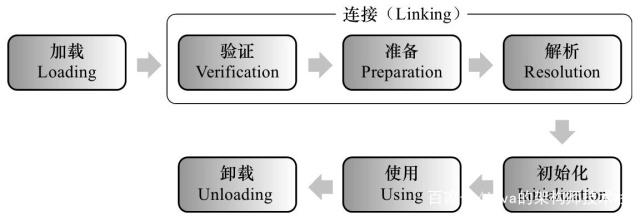

# Java类加载机制

## 一、什么是类的加载

从上图可以看，java文件通过编译器变成了.class文件，接下来类加载器又将这些.class文件加载到JVM中。其中**类装载器**的**作用**其实就是类的加载。今天我们要讨论的就是这个环节。有了这个印象之后我们再来看**类的加载**的概念：

> 类的加载指的是将类的.class文件中的二进制数据读入到内存中，将其放在运行时数据区的方法区内，然后在堆区创建一个 java.lang.Class对象，用来封装类在方法区内的数据结构。

### 1、什么时候启动类加载器

类不是在在首次使用之前就需要被加载，而是JVM规范允许类加载器预料某个类要使用时预先加载，如果在预先加载过程中遇见.class文件缺失或者错误，程序将在首次使用该类时报LinkageError错误。如果此类一直没有被程序主动使用，类加载器也不会报错。

### 2、在哪个地方加载class文件

1. 本地磁盘
2. 数据库
3. 网上加载.class文件（Applet）
4. 压缩文件中（zar 或者jar中）
5. 从其他文件生成（JSP)

## 二、类加载的过程

### 1、加载

从本地或者网络端读取一个字节流，将一些静态存储结构转化为方法区中运行时数据，最后生成一个class对象，作为方法区访问此类的入口

### 2、验证

**文件格式的验证：**
①是否以魔数0xCAFEBABE开头；
②主次版本号是否在当前虚拟机处理范围内；
③常量池中的常量是否有不被支持的常量类型等等。

**元数据的验证：**
①这个类是否有父类；
②这个类的父类是否继承了不被允许继承的类(final修饰的类)；
③这个类不是抽象类，是否实现了所有接口中要实现的方法等等。

**字节码的验证：**
①保证跳转指令不会跳转到方法体以外的字节码指令上；
②保证方法体中的类型转换是有效的等等。

**符号引用的验证：**
①能否通过类的全限定名去找到对应的类；
②符号引用中的类、字段、方法是否可以被当前类访问等等。

### 3、准备

这个过程相当于给类变量分配内存并设置初始值，这些变量所使用的的内存都在方法区中进行分配。

这里有个特殊情况，如果该字段被 `final`修饰，那么在准备阶段改字段就会被设置成咱们自定义的值。

### 4、解析

将符号引用转化为直接引用的过程：

+ 符号引用：符号引用与虚拟机的布局无关，甚至引用的目标不一定加载到了内存中。符号可以是任何形式的字面量，只要使用时能够准确的定位到目标即可。

+ 直接引用：直接引用可以直接指向目标的指针、相对偏移量或是一个能间接定位到目标的句柄。直接引用与虚拟机布局有关，如果有了直接引用，那么引用的目标必定已经在内存中存在。

### 5、初始化

在准备阶段变量已经被赋值为系统要求的默认值，在初始化阶段，则会根据程序制定的主观计划去初始化类变量和其他资源。

ps：在同一个类加载器下，一个类只会初始化一次。多个线程同时初始化一个类，只有一个线程能正常初始化，其他线程都会进行阻塞等待，直到活动线程执行初始化方法完毕。

